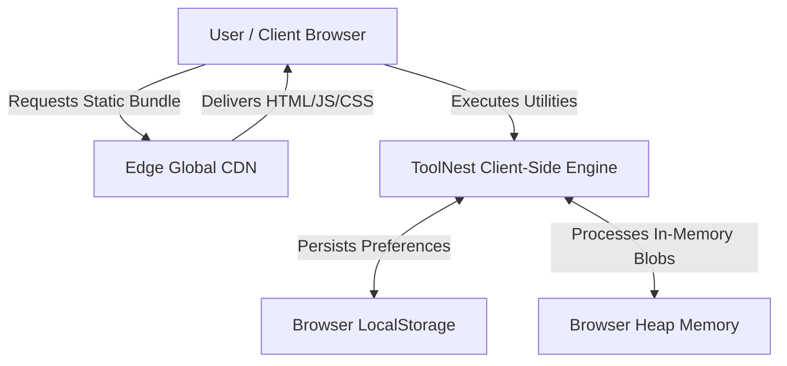

# System Overview Architecture

## Overview
**ToolNest** is an enterprise-grade, browser-native digital utility platform offering 40 client-side tools across 5 specialized domains: PDF & Document Suite, Image Studio, Developer & QR Tools, Calculators & Converters, and Text & Typography.

Unlike traditional SaaS utility platforms that upload files, tokens, or queries to remote servers, ToolNest operates with **100% client-side execution**. All processing occurs locally within the user's browser sandbox, ensuring absolute data sovereignty, high performance, and zero server infrastructure costs.

## C4 System Context Model

## Architectural Tenets

### 1. In-Browser Isolation
- Files, images, credentials, and cryptographic seeds **never** leave the client's physical machine.
- Operations run directly on the browser V8 engine, Web Workers, HTML5 Canvas 2D context, and W3C Web Cryptography API.

### 2. Zero-Backend Tier
- There is no central API server, database, queue, or proxy service.
- Operational overhead is effectively zero, making the application infinitely scalable across global Anycast CDNs.

### 3. Progressive Code Splitting
- Tool suites and large computational dependencies (`pdf-lib`, `pdfjs-dist`, `browser-image-compression`) are dynamically split into asynchronous chunks via Vite 6.
- The initial page load loads only the lightweight shell and core routing, achieving fast time-to-interactive (TTI).

### 4. Deterministic State & Persistence
- State persistence is restricted to non-sensitive user preferences:
  - `toolsnest_theme`: `'dark' | 'light'`
  - `toolsnest_favorites`: Array of tool IDs
  - `toolsnest_recent`: Array of up to 20 recently visited tool IDs
- Document contents and transient binary buffers exist strictly in heap memory and are wiped on tab close.
