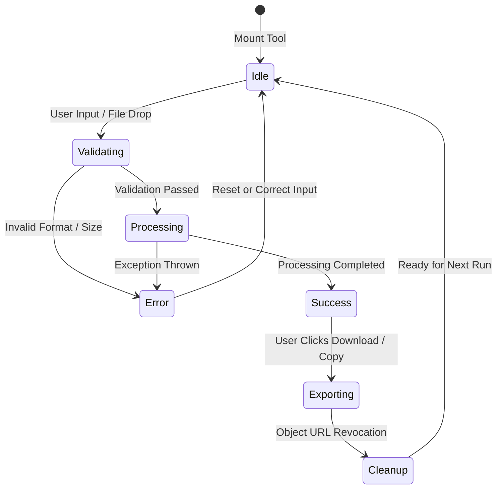

# Tool Execution Flow & State Machine

## Lifecycle Sequence
Every tool in ToolNest follows a deterministic execution lifecycle to guarantee responsive UI feedback, data integrity, and safe memory reclamation.

## Step-by-Step Lifecycle

1. **Mount & Route Resolution**:
   - `ToolWorkspacePage` parses `:slug` from the URL.
   - Searches `tools.ts` for the matching tool definition.
   - Dispatches `addRecent(tool.id)` to record the tool in `localStorage`.

2. **Input Ingestion & Validation**:
   - Accepts text input, form values, or dropped files via `FileUploadDropzone`.
   - Validates MIME types, maximum file size thresholds (e.g., 50MB for PDF, 25MB for images), and string syntax.
   - If invalid, halts immediately and displays inline validation alerts with an error toast.

3. **In-Memory Computation**:
   - Processing is triggered asynchronously.
   - UI reflects processing state via spinner or progress bar.
   - Operations occur strictly in browser memory (ArrayBuffer, Canvas 2D buffer, or Web Crypto primitives).

4. **Result Presentation**:
   - Results are rendered with side-by-side comparison, preview panes, or syntax-highlighted code.
   - Action buttons (Copy to Clipboard, Download File, Reset) become active.

5. **Resource Reclamation**:
   - When files are downloaded, `URL.createObjectURL(blob)` generates a temporary URL.
   - An immediate cleanup hook schedules `URL.revokeObjectURL(url)` to prevent memory leaks in the browser heap.
